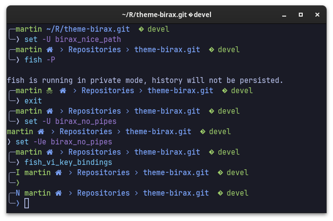

#### birax
> A theme for [Oh My Fish][omf-link].

[](/LICENSE)
[](https://fishshell.com)
[](https://www.github.com/oh-my-fish/oh-my-fish)

<br/>

Fork of [om-my-fish](https://github.com/oh-my-fish/theme-bira) with some extra
sparkle.

## Install

```fish
$ omf install github.com/martinparadiso/theme-birax
```

**NOTE**: The theme uses [Nerd Fonts](https://www.nerdfonts.com/) by default,
if you see strange characters either install a patched font, or replace the icons with:

```fish
set -U birax_home_icon '~'
set -U birax_git_icon ''
set -U birax_shell_icon '$ '
set -U birax_private_icon '(private)'
```

## Features

- 'Nice path' mode by setting an Universal variable `birax_nice_path`
- Hide the 'pipes' by setting `birax_no_pipes`
- Python VirtualEnv version
- Private mode icon
- Experimental support for Vi mode

## Screenshot

<p align="center">

</p>

# Usage

You can tweak the following environment variables to customize the theme.
'Flag' variables are 'active' if they are present with any value (can be
empty). 'text' variables are used only if present, and the text given is
used in the corresponding place, can be empty to remove the icon.

| Variable              | Type      | Notes                                                     |
|-----------------------|-----------|-----------------------------------------------------------|
| `birax_nice_path`     | flag      | Replace fish std. path function with something nicer.     |
| `birax_no_pipes`      | flag      | Remove the 'pipes' connecting the prompt lines            |
| `birax_home_icon`     | text      | Set the icon for the `HOME` directory in nice path mode   |
| `birax_home_git`      | text      | Set the icon to prepend to current `git` checkout         |
| `birax_shell_icon`    | text      | Set the icon for shell prompt                             |
| `birax_private_icon`  | text      | Set the icon to indicate the shell is in private mode     |


To change an icon or activate a flag:

```fish
set -U <variable> <optional-content>
```

To disable a flag or go back to default icons:

```fish
set -Ue <variable>
```
p
# License

[MIT][mit] © [Martín Paradiso][author] et [al][contributors]


[mit]:            https://opensource.org/licenses/MIT
[author]:         https://github.com/martinparadiso
[contributors]:   https://github.com/martinparadiso/theme-birax/graphs/contributors
[omf-link]:       https://www.github.com/oh-my-fish/oh-my-fish

[license-badge]:  https://img.shields.io/badge/license-MIT-007EC7.svg?style=flat-square
